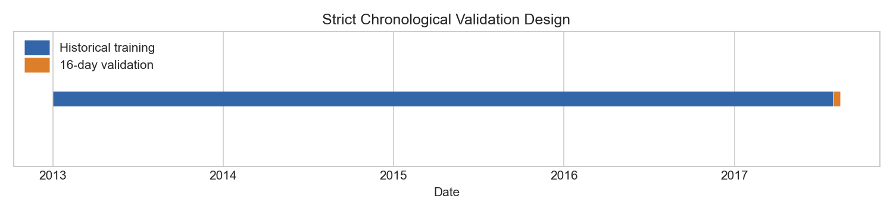

# Baseline Forecasting Results

## 1. Purpose

Stage 3 establishes a leakage-safe chronological evaluation and transparent benchmarks. It does not train a machine-learning model or forecast the Kaggle test set.

## 2. Validation design

Historical training runs from **2013-01-01** through **2017-07-30**. Validation uses the final 16 training dates, **2017-07-31** through **2017-08-15**, with **28,512 rows**, 54 stores, and 33 families. Random splitting would mix future observations into training and misrepresent the competition forecast setting.

## 3. Leakage prevention

Every prediction is computed only from sales before validation starts. Validation targets never update later forecasts, centered windows are not used, and the repeated-week method repeats the final complete historical week instead of reading validation lags. Missing estimates fall back from store-family to family, global history, and finally zero.

## 4. Evaluation metric

RMSLE is the primary metric. Predictions are clipped to zero, actual sales are verified nonnegative, and all methods use the same NumPy implementation. MAE is included only as a secondary scale-dependent description.

## 5. Baselines compared

Six methods were evaluated: zero, last value, 7-day mean, 28-day mean, recent 8-week weekday mean, and a leakage-safe repeated final-week pattern.

## 6. Overall results

| Rank | Baseline | RMSLE | MAE | Rule |
|---:|---|---:|---:|---|
| 1 | Weekday mean (8 weeks) | 0.520631 | 84.10 | Series-weekday mean from prior 8 weeks |
| 2 | Recent mean (28 days) | 0.521588 | 97.22 | Repeat mean of final 28 historical dates |
| 3 | Recent mean (7 days) | 0.524003 | 98.61 | Repeat mean of final 7 historical dates |
| 4 | Repeated final week | 0.617040 | 96.54 | Repeat final complete 7-day historical pattern |
| 5 | Last observed value | 0.659484 | 207.51 | Repeat final pre-validation value |
| 6 | Zero forecast | 4.419500 | 467.14 | Predict 0 |

The best method is **Weekday mean (8 weeks)** with RMSLE **0.520631**. The 28-day and 7-day means are close behind. Weekly weekday matching provides a small improvement over these local-level averages, while copying one exact week or one final value is less stable.

## 7. Error differences across families and stores

The easiest families under the best baseline include BOOKS, PRODUCE, DAIRY. The highest-error families include GROCERY II, LINGERIE, SCHOOL AND OFFICE SUPPLIES. Store errors also vary; stores 48, 47, 50 have the largest RMSLE under this baseline. These rankings show where simple local seasonal averages fail, not why they fail.

## 8. Representative forecast behavior

Mechanically selected low-, medium-, and high-volume series show that a stable aggregate score can coexist with flat forecasts, intermittent targets, and short-lived spikes. Simple averages cannot react to unexpected events within the 16-day horizon.

## 9. Main findings

- The 8-week weekday mean is the strongest baseline at RMSLE 0.520631.
- Weekly seasonal matching helps slightly relative to 7- and 28-day constant means.
- The 28-day mean is slightly more stable than the 7-day mean.
- Repeating one exact week is weaker than averaging corresponding weekdays across eight weeks.
- Error differs substantially across families, stores, and validation dates.
- Zero and last-value forecasts are inadequate reference methods for this data.

## 10. Implications for Stage 4

Later work should retain this exact split and beat RMSLE **0.520631**. Promotions and calendar information may help, but must be constructed only from information available at forecast time. Family and store heterogeneity should remain visible in evaluation.

## 11. Limitations

This is one recent 16-day holdout and may be affected by unusual dates. Baselines do not adjust for promotions, holidays, trend changes, or special events. The score does not guarantee Kaggle leaderboard performance, and no method is claimed to be universally best.

## 12. Conclusion

The validation framework is chronological, reproducible, and leakage-safe. The recent weekday mean provides a clear benchmark for later stages without introducing a machine-learning model or generating test predictions.
