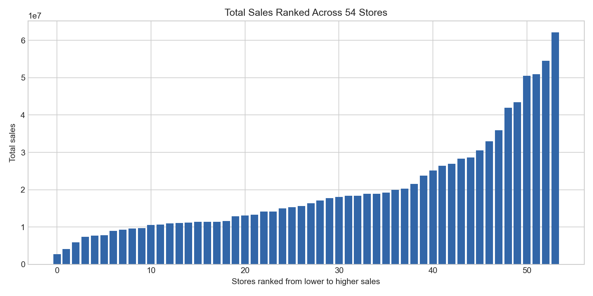
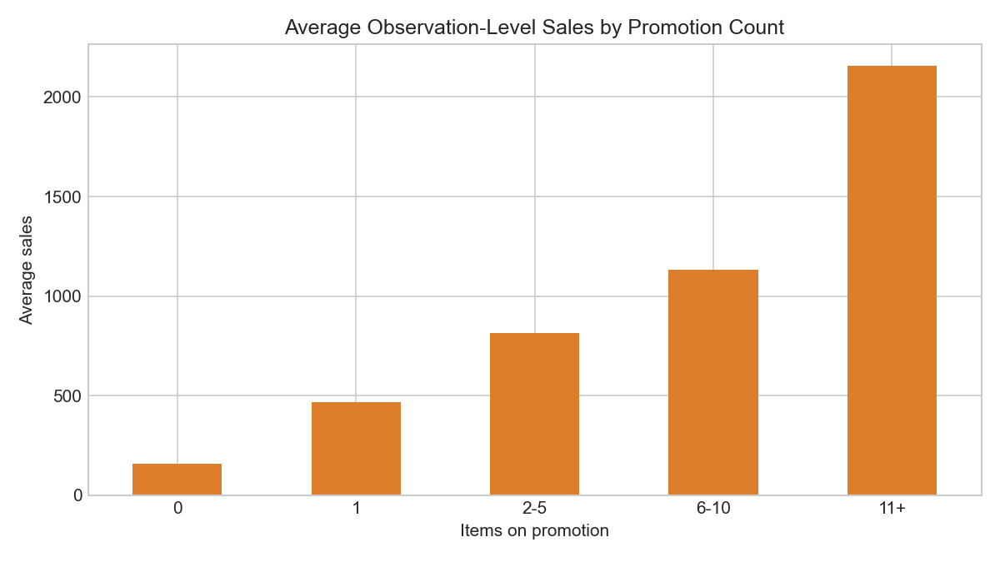

# Exploratory Data Analysis Summary

## 1. Purpose and scope

This Stage 2 analysis describes the main temporal, product, store, promotion, transaction, holiday, earthquake, and oil-price patterns in the Store Sales data. It is exploratory and associative: it does not establish causal effects, train a model, or define a validation split.

## 2. Data used

The analysis uses the raw training data (3,000,888 rows from 2013-01-01 to 2017-08-15), store metadata, transactions, holidays/events, oil prices, and test dates. Raw files were read without modification. The full training file was loaded once and aggregated before plotting.

## 3. Overall temporal patterns

Aggregate sales show strong short-term variation, recurring weekly structure, a generally changing level over the multi-year period, and isolated spikes and declines. The 7-day line below is descriptive smoothing only.

## 4. Weekday and monthly patterns

Average weekend aggregate sales were 798,657, compared with 573,143 on weekdays. Day-of-week differences support testing weekly seasonal baselines later. Calendar-month averages also vary, although these averages combine different years and changing sales levels.

## 5. Product-family differences

Sales are concentrated: the five largest families account for 78.7% of total sales and the ten largest account for 93.0%. Family scales differ substantially, so aggregate accuracy alone could hide weak performance for smaller families. Sales volume is not a measure of profitability.

## 6. Store differences

Store totals vary widely across the 54 stores. Average store-day sales also differ across store types and clusters, but the comparisons are descriptive and may reflect location, size, assortment, or other factors.

## 7. Promotion patterns

Positive promotion counts occur in 20.4% of observations. Average observation-level sales were 1137.69 when promoted and 158.25 when not promoted. The size of this association differs across families, but targeting means it must not be interpreted causally.

## 8. Transactions and sales

The `date + store_nbr` merge produced 83,488 matched store-days. Transactions and aggregate store-day sales have a descriptive Pearson correlation of 0.837. Transactions are historical and cannot be directly observed for future test dates.

## 9. Holidays and earthquake observations

The holiday comparison uses only national, non-transferred records and excludes `Transfer` rows. National holiday dates differ from ordinary dates, but date composition, closures, seasonality, and overlapping events limit interpretation. Local and regional records require store-aware matching and were not merged by date alone.

Around 16 April 2016, aggregate sales show a visible short-run disturbance. Mean daily sales were 793,003 in the prior 14 days, 937,600 in the first 14 days after, and 789,029 in days 15-42 after. This pattern is not causal evidence because other seasonal and operational factors may contribute.

## 10. Oil-price observations

Oil data cover 2013-01-01 to 2017-08-31 and contain 43 missing prices. The monthly oil-sales correlation is -0.788, a broad descriptive association that does not imply direct short-run influence. No permanent oil-price imputation was performed.

## 11. Implications for later modeling

- Use time-based validation and match the actual **16-day** test horizon.
- Test a simple weekly seasonal baseline because weekday patterns are visible.
- Evaluate performance across families and stores because their sales scales differ strongly.
- Consider promotions and carefully constructed calendar information in later feature work.
- Treat the earthquake and other special-event windows cautiously when choosing validation periods.
- Do not assume future transactions are available.

## 12. Limitations

This is aggregate descriptive analysis. It does not control for confounding, test statistical significance, establish stationarity, or measure causal effects. Holiday analysis is intentionally limited, oil prices remain incomplete, and aggregate plots can hide store-family differences. The 7-day smoothing is visual only.

## 13. Stage 2 conclusion

The data show changing sales levels, weekly structure, strong scale differences, promotion associations, and identifiable special-event periods. These findings are sufficient to motivate simple time-aware baselines and carefully scoped feature work in later stages, without selecting a model now.
