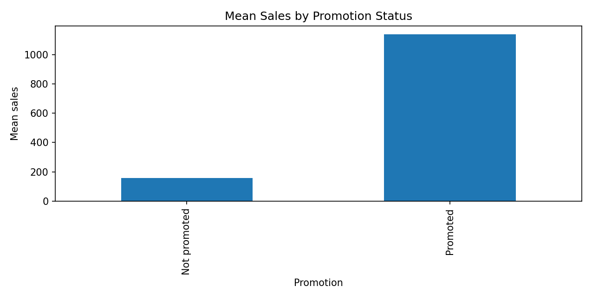

# Exploratory Data Analysis

The training panel contains 3,000,888 rows from 2013-01-01 through 2017-08-15, covering 54 stores and 33 product families. The figures below describe associations in the observed panel; they do not establish causal effects.

The panel has strong scale differences across families and stores, visible weekly structure, and a positive descriptive association between promotion status and sales. Those patterns motivate log-scale error, pooled categorical models, calendar inputs, and known-future promotion features. The forecast protocol still freezes every target-history input at the forecast origin.

